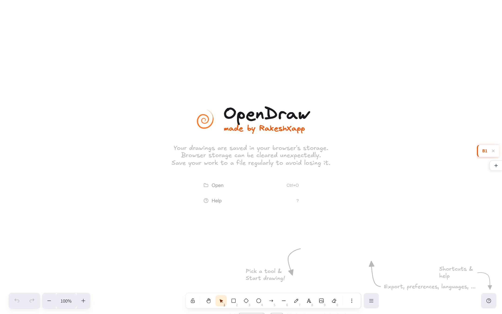
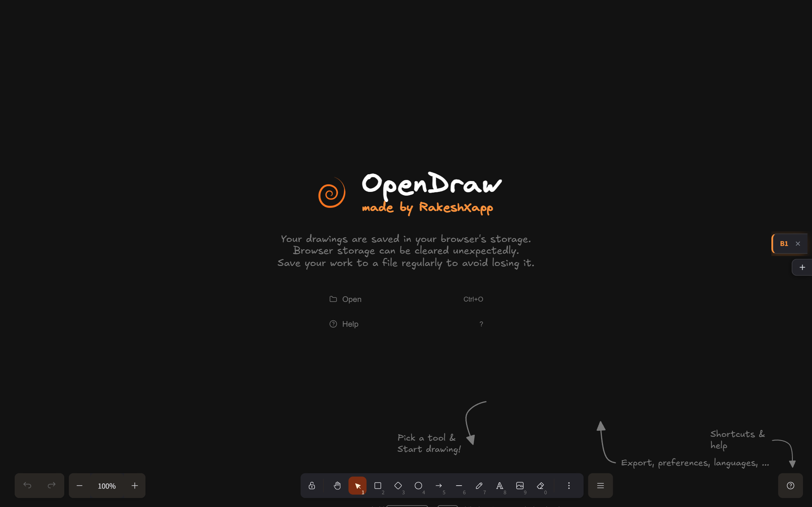

<div align="center">
  
  <h1>OpenDraw</h1>
  <p><strong>Offline whiteboard PWA — hand-drawn style diagrams, multi-board tabs, works without internet.</strong></p>
  <p>Made by <a href="https://github.com/RakeshChandraMahato">RakeshXapp</a></p>

  <p>
    <a href="https://github.com/RakeshChandraMahato/OpenDraw/blob/master/LICENSE">
      
    </a>
    
    
    
  </p>
</div>

---

## Screenshots

<div align="center">

### 🌞 Light Mode — Welcome Screen


### 🌙 Dark Mode — Canvas


### ☀️ Light Mode — Canvas


</div>

---

## ✨ Features

- 🗂️ &nbsp;**Multi-board tabs** — manage multiple drawing boards (B1, B2, B3…) from right-side bookmark tabs
- 💾 &nbsp;**Offline-first** — all boards saved to IndexedDB, no server needed
- 📱 &nbsp;**Installable PWA** — install from Chrome as a standalone desktop/mobile app
- 🎨 &nbsp;**Infinite canvas** — hand-drawn style whiteboard
- 🌓 &nbsp;**Dark / Light mode** — with orange accent theme
- ✍️ &nbsp;**Rich tools** — rectangle, circle, diamond, arrow, line, free-draw, eraser, text
- 🖼️ &nbsp;**Image support** — embed images on canvas
- 📤 &nbsp;**Export** — PNG, SVG, clipboard, or `.opraw` file
- 📂 &nbsp;**Open files** — `.opraw`, `.excalidraw`, `.json`, `.png`, `.svg`
- 🔙 &nbsp;**Undo / Redo**
- 🔍 &nbsp;**Zoom & pan**
- 🌐 &nbsp;**i18n** — 30+ languages

---

## 🚀 Deploy

OpenDraw is configured for zero-config **Cloudflare Pages** deployment.

### One-click deploy:

1. Fork / clone this repo to your GitHub account
2. Go to [Cloudflare Pages](https://pages.cloudflare.com/) → **Create a project** → connect your repo
3. Cloudflare reads `pages.toml` automatically:
   - **Build command:** `pnpm build`
   - **Output directory:** `excalidraw-app/build`
   - **Node version:** 22
4. Click **Deploy** 🎉

---

## 🛠️ Local Development

**Requirements:** Node 22+, pnpm

```bash
# Install dependencies
pnpm install

# Start dev server (http://localhost:3001)
pnpm start

# Production build
pnpm build
```

The build output is at `excalidraw-app/build/` — ready to upload to any static host.

---

## 📁 Project Structure

```
OpenDraw/
├── excalidraw-app/          # Main app (Vite + React)
│   ├── components/
│   │   └── BookmarkTabs.tsx # Multi-board tab UI (right side)
│   ├── data/
│   │   └── boardsManager.ts # IndexedDB board persistence
│   └── vite.config.mts      # Vite + PWA config
├── packages/excalidraw/     # Core drawing engine
├── public/                  # Static assets, icons, _headers, _redirects
└── pages.toml               # Cloudflare Pages config
```

---

## 📄 License

MIT — based on [Excalidraw](https://github.com/excalidraw/excalidraw) (MIT).
